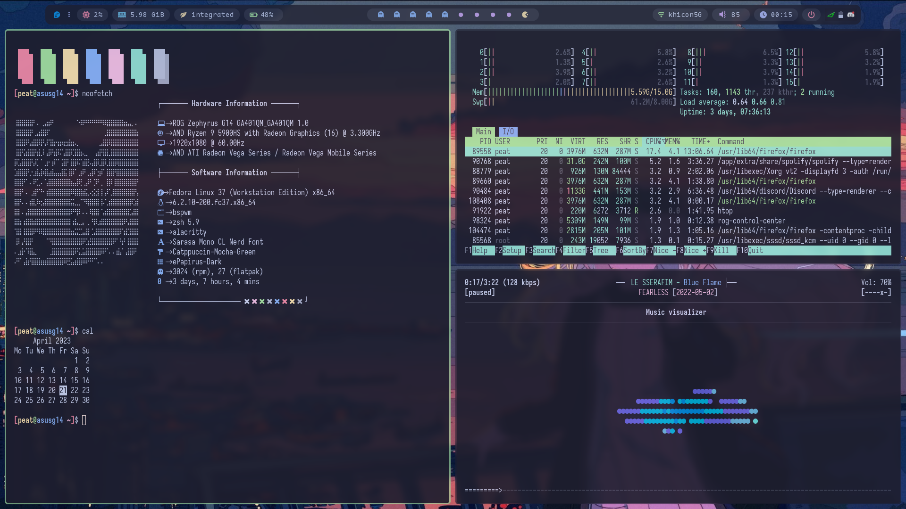

# dotfiles
These are my dotfiles for dwm and bspwm

**STUFF THAT I USE**:

- **OS**: [Fedora 37](https://getfedora.org/)
- **WM**: [BSPWM](https://github.com/baskerville/bspwm)
- **Terminal**: [Alacritty](https://github.com/alacritty/alacritty)
- **Shell**: [ZSH](https://github.com/ohmyzsh/ohmyzsh)
- **Compositor**: [Picom](https://github.com/ibhagwan/picom)
- **Application Launcher**: [Rofi](https://github.com/davatorium/rofi)
- **File Manager**: [Thunar](https://github.com/xfce-mirror/thunar)
- **Icons**: [Papirus-Dark](https://github.com/PapirusDevelopmentTeam/papirus-icon-theme)
- **Font**: [Sarasa Mono CL Nerd Font](https://github.com/jonz94/Sarasa-Gothic-Nerd-Fonts)
- **Editor**: [Neovim with nvchad](https://nvchad.com/)
- **Music Player**: [ncmpcpp](https://github.com/ncmpcpp/ncmpcpp)
